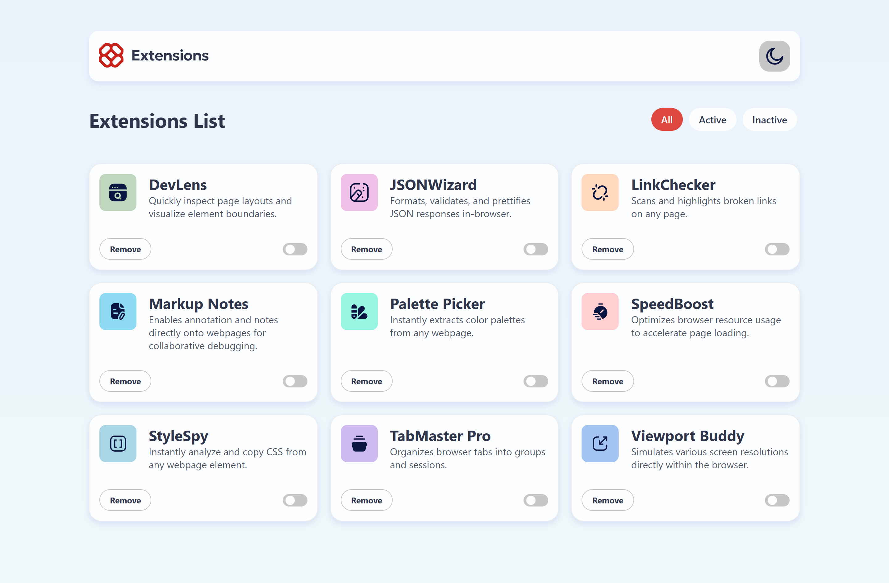
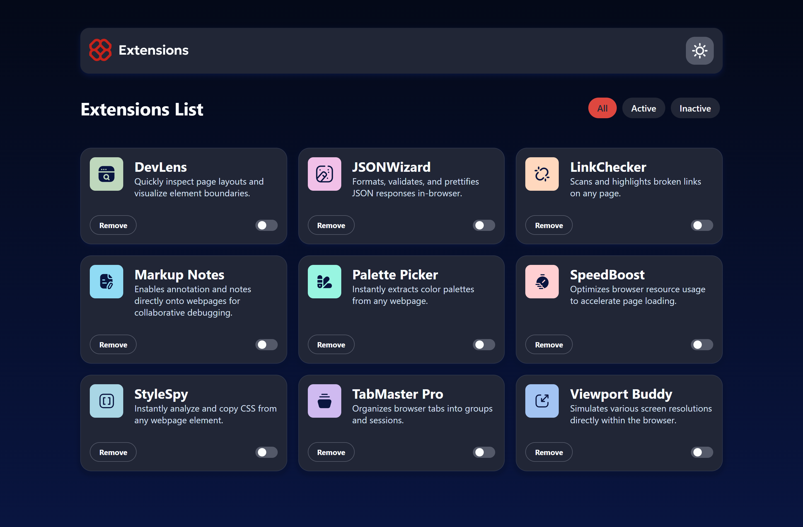

# Frontend Mentor - Browser extensions manager UI solution

This is a solution to the [Browser extensions manager UI challenge on Frontend Mentor](https://www.frontendmentor.io/challenges/browser-extension-manager-ui-yNZnOfsMAp). Frontend Mentor challenges help you improve your coding skills by building realistic projects. 

### Screenshot

### Links

- Solution URL: [Extension-Manager-Ui](https://your-solution-url.com)
- Live Site URL: [Extension-Manager-Ui](https://browser-extension-nu-six.vercel.app/)

## My process

### Built with

## 🛠 Tech Stack

- **Language:** JavaScript (ES6+)
- **Framework:** React.js (Functional Components & Hooks)
- **Build Tool:** Vite
- **Routing:** React Router DOM
- **State Management:** React `useState`, `useEffect`
- **Persistence:** Local Storage (`use-local-storage`)
- **Styling:** CSS (Custom Properties / CSS Variables)
- **Theming:** Light & Dark mode with `data-theme` and `prefers-color-scheme`
- **Animations:** Framer Motion
- **Modals:** React Portals (`createPortal`)
- **Data Handling:** Static JSON data, array mapping & filtering
- **Assets:** SVG icons and logos
- **Accessibility:** Keyboard focus & semantic HTML
- **Browser APIs:** `window.matchMedia`, `localStorage`
- **Package Manager:** npm
- **Version Control:** Git
- **Deployment:** Vercel

## Author

- Website - [Godwin Oamien John](https://godwins-portfolio.vercel.app )
- Frontend Mentor - [@Wariboko65](https://www.frontendmentor.io/profile/Wariboko65)
